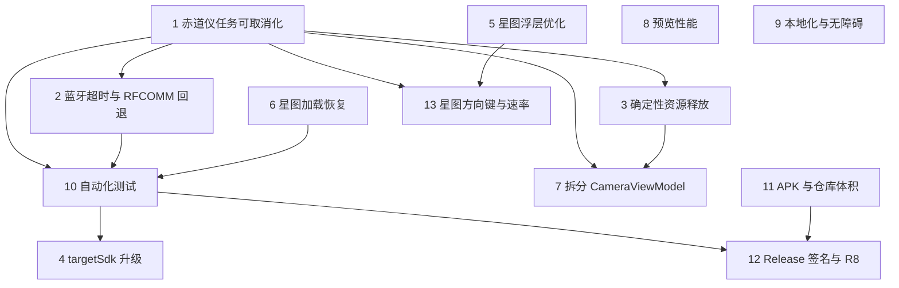

# Mobile Observatory TODO

> 本文档记录待评估的优化事项。优先级仅表示风险与收益，不代表最终实施顺序。
>
> 状态约定：`[ ]` 待办、`[~]` 进行中、`[x]` 已完成、`[-]` 暂不实施。

## 决策区

在确定实施顺序后填写：

| 顺序 | 事项 | 决策/备注 |
|---:|---|---|
| 1 |  |  |
| 2 |  |  |
| 3 |  |  |
| 4 |  |  |
| 5 |  |  |

---

## P0：设备安全与连接可靠性

### [x] 1. 赤道仪任务可取消化与安全停止

**涉及模块**

- `MountMotionRunner` 统一运动生命周期
- `CameraViewModel` 中的 GOTO、回零、定距 RA、手动移动和断开流程
- `Lx200MountController` 的协议级全轴停止
- `CameraScreen` 全局 STOP 控件

**已完成**

- 建立结构化 `MountMotionState`，同一时间只允许一个活动运动。
- 星图 GOTO、回零、定距 RA 和手动移动全部接入统一 runner。
- 用户停止时先取消本地任务，并立即在不可取消上下文中发送协议级全轴停止。
- 运动异常会自动尝试全轴停止，正常完成不会误发停止命令。
- 断开赤道仪前会先停止活动运动；应用销毁时会在关闭 transport 前尽力停止。
- GOTO 期间在所有应用页面持续显示醒目的全局 STOP 按钮，并显示 STOPPING 状态。
- 运动期间拒绝启动第二个冲突动作；方向键松手不会误停一个被拒绝的 GOTO。
- 星图 GOTO 使用坐标轮询和球面角距离判断到达目标，连续两次进入 0.05° 容差后结束。
- 回零使用坐标稳定性检测，并为 GOTO/回零设置 5 分钟超时。

**验收结果**

- [x] 定距移动可立即停止，停止后不会更新为“完成”。
- [x] 星图 GOTO 和回零全过程都有 STOP 按钮。
- [x] STOP 在星图、赤道仪、相机、器材、导星、极轴校准和播放器页面均持续可见。
- [x] 断开连接会取消活动运动并发送停止命令。
- [x] 取消和异常路径会尽最大努力发送一次全轴停止命令。
- [x] 不会同时运行两个互相冲突的运动命令。
- [x] 自动化测试覆盖停止、异常、并发拒绝和正常完成路径。
- [ ] 使用真实 OnStep、iOptron 和 SkyWatcher 赤道仪验证 GOTO 完成容差与停止响应。
- [ ] 真机确认不同页面及 WebView 上方的全局 STOP 按钮触控正常。

**风险/成本：** 已完成；仍需多协议真机验证。

---

### [x] 2. OnStep 蓝牙连接超时与 RFCOMM 兼容回退

**涉及模块**

- `Lx200MountController.connectBluetooth()`
- Bluetooth transport adapter
- 赤道仪连接状态 UI

**现状**

- 当前只使用 `createRfcommSocketToServiceRecord(SPP_UUID)`。
- `BluetoothSocket.connect()` 没有明确、可展示的应用层超时。
- 部分 HC-05、HC-06 或 OnStep 蓝牙模块可能只兼容 insecure RFCOMM。
- 连接中缺少取消入口和分阶段状态。

**建议**

- 为蓝牙连接增加 10～15 秒超时。
- 首次连接失败后尝试 `createInsecureRfcommSocketToServiceRecord()`。
- 如确有设备需要，再评估反射创建 RFCOMM channel 1；默认不要依赖反射。
- 取消或超时时主动关闭正在连接的 socket。
- UI 显示“标准模式连接中”“正在尝试兼容模式”“已取消”“连接超时”。
- 记录各连接阶段和错误原因，但不要记录敏感设备信息之外的数据。

**验收标准**

- [x] 无响应设备不会导致连接界面长期卡住。
- [x] 用户可取消正在进行的连接。
- [x] 标准 RFCOMM 失败后可自动尝试 insecure RFCOMM。
- [x] 成功、超时、权限拒绝、蓝牙关闭和未配对设备有不同提示。
- [ ] 使用至少一个真实 OnStep 蓝牙模块完成连接与坐标读取验证。

**依赖：** 建议与“赤道仪任务可取消化”一起设计。

**风险/成本：** 中。

---

### [x] 3. 应用销毁时确定性释放设备资源

**涉及模块**

- `CameraViewModel.onCleared()`
- 相机、赤道仪、导星和配件 manager/controller

**原问题**

- `onCleared()` 内通过即将取消的 `viewModelScope` 启动异步断开，无法保证完成。
- 多个显式 Job、writer 和设备连接缺少统一关闭顺序。

**已完成**

- 统一取消全部 ViewModel 子任务和显式持有的后台任务。
- 同步结束录制线程并关闭 SER、PSER、MP4 writer。
- 同步注销广播并关闭所有设备 manager/controller 和 transport。
- 提供按顺序、异常隔离且幂等的统一清理器。

**验收结果**

- [x] 销毁时取消全部子任务及显式 Job。
- [x] 录制线程结束，所有 writer 同步关闭。
- [x] 相机、导星相机、配件及赤道仪 transport 同步关闭。
- [x] 重复执行清理不会重复释放，单步失败不会阻止后续步骤。
- [x] 自动化测试覆盖清理顺序、异常隔离和幂等性。
- [ ] 真机确认 Activity 重建后各设备可以正常重连。

**实现说明**

- 关闭顺序为：取消 ViewModel 子任务和显式 Job → 注销自有广播 → 结束录制线程并关闭 writer → 关闭相机、导星相机、配件和赤道仪 transport。
- `Lx200MountController.close()` 是同步、幂等的生命周期终止接口，不依赖 `viewModelScope`；正常业务断开仍使用 suspend `disconnect()`。
- 销毁时不再启动 MP4 图库复制任务，避免依赖即将取消的 scope；录制原文件仍保留在应用目录。
- 正在建立的 TCP、USB 或蓝牙连接从创建起即归 controller 所有，销毁可关闭底层资源解除阻塞。

**风险/成本：** 已完成；仍需真机验证 Activity 重建和厂商 SDK 重连。

---

## P1：Android 兼容性与星图体验

### [ ] 4. 分阶段升级 `targetSdk`

**涉及模块**

- `app/build.gradle.kts`
- Android Manifest 和运行时权限流程
- 厂商相机 SDK、文件存储、WebView 和蓝牙

**现状**

- `compileSdk = 34`，但 `targetSdk = 28`。
- lint 禁用了 `ExpiredTargetSdkVersion`。
- 现代 Android 对蓝牙、存储、通知、WebView 和后台行为的规则与 API 28 差异较大。

**建议**

- 不要只修改版本号；按 API 29、31、33、34/35 的行为变化建立迁移清单。
- 重点验证 Scoped Storage、附近设备权限、USB、WebView、前后台切换和厂商 native SDK。
- 移除过期权限与 lint 豁免。
- 建立 Android 12～15 真机/模拟器兼容测试矩阵。

**验收标准**

- [ ] 目标 API 达到计划发布渠道的最新要求。
- [ ] Android 12、13、14、15 上完成相机、赤道仪、文件保存和星图冒烟测试。
- [ ] 不再禁用 `ExpiredTargetSdkVersion`。
- [ ] 权限拒绝和“不要再询问”状态有清晰恢复指引。
- [ ] 旧 Android 最低版本仍符合 `minSdk` 约束。

**风险/成本：** 中高；需要重点验证第三方相机 SDK。

---

### [x] 5. 星图浮层自动收起与进一步紧凑化

**涉及模块**

- `StarMapScreen`
- Stellarium WebView 覆盖层

**已完成**

- 目标卡片默认仅显示目标名和 GOTO；点击目标名展开坐标与连接提示。
- 大气开关与“锁定浮层”收进右上角设置菜单。
- Ready 状态下空闲约 4 秒后淡出非必要浮层；点击星图区域或选择目标后重新显示。
- 返回按钮始终可见，保留可访问名称。
- 提供“锁定浮层”选项，避免连续操作时自动隐藏。

**验收结果**

- [x] 无目标时核心遮挡可自动收起，仅保留返回按钮。
- [x] 有目标时默认单行紧凑布局（名称 + GOTO）。
- [x] 浮层隐藏后可通过点击星图恢复。
- [ ] 横屏不同分辨率下真机确认无控件重叠或越界。
- [x] 返回、设置和 GOTO 具备可访问名称。

**风险/成本：** 低中；多分辨率真机布局仍需确认。

---

### [x] 6. 星图 WebView 加载失败、超时与崩溃恢复

**涉及模块**

- `StarMapScreen`
- `StarMapLoadRules`
- Stellarium asset loader

**已完成**

- 处理主框架 `onReceivedError()`、HTTP 错误和 `onRenderProcessGone()`。
- 引擎启动超时 45 秒，超时后进入可重试错误态。
- 错误卡片提供“重新加载星图”；重试前销毁旧 WebView/JS bridge 并递增 session。
- 抽取 `StarMapLoadRules` 覆盖 ready/failure/timeout 状态迁移，并补充单元测试。
- Ready 后的迟到失败不会覆盖已就绪状态。

**验收结果**

- [x] 资源缺失、损坏或加载超时时显示可理解的错误与重试入口。
- [x] 用户可以原地重试，无需重启应用。
- [x] renderer 崩溃后进入错误态并可重新加载。
- [x] 重试通过 session key 重建 WebView，避免重复 bridge。
- [x] 有加载成功、失败、超时状态迁移单元测试。
- [ ] 真机验证资源缺失与超时路径的实际提示文案。

**风险/成本：** 中；真机 WebView/资源路径仍需确认。

---

### [x] 6b. 星图闭环「指向并居中」（解析 → 同步 → 再 GOTO）

**涉及模块**

- `MountModule.startPrecisionGoto` / `PrecisionGotoMath`
- `CameraViewModel.captureAndSolveForPrecisionGoto`
- 星图「指向并居中」按钮与进度文案

**已完成**

- 选中天体后可启动「指向并居中」：GOTO → 等帧拍照 → ASTAP 解析 → 星图居中到解算坐标 → 误差 >2′ 则 sync（或 SkyWatcher 纠偏 GOTO）→ 再对准，最多 5 轮。
- 收敛判据为解算天空位置相对目标的球面角距 ≤ 2′；可用全局 STOP 中止。
- 目视「同步」与单次 GOTO 仍保留；「视场居中 / 居中到赤道仪」收到展开详情里，默认只显示目标名 + 指向并居中 + GOTO。

**验收标准**

- [x] 单元测试覆盖角距与纠偏坐标计算。
- [ ] OnStep / iOptron 真机：指向并居中收敛到 ≤2′。
- [ ] SkyWatcher：无 sync 时纠偏路径可用。
- [ ] 相机未连接或未装 D50 时有明确提示。

**风险/成本：** 依赖曝光/星库/焦长提示；长曝光时需等新帧。

---

### [ ] 6c. 星图显示相机 / 目镜视野范围

**涉及模块**

- `StarMapScreen` 视野设置入口（现有 FOV 对话框为雏形）
- Stellarium `MercStarMap` / `fov-frame` 叠加层
- 相机焦长、像素尺寸、ROI；目镜焦距与视场角

**现状**

- 已有手动输入：目镜角径会改星图缩放；传感器宽高会画一个屏幕居中框。
- 目镜没有真实的圆形视野圈；传感器框是屏幕比例近似，不随缩放按真实角径绑定，也不会跟随赤道仪指向。
- 未从已连接相机自动推算 FOV，也没有目镜预设库。

**建议**

- 在星图上叠加**真实角径**的视野指示：相机用矩形（可跟 ROI），目镜用圆形（或视场光阑形状）。
- 支持相机与目镜两种模式切换；参数可手动填，也可由相机元数据 / 常用目镜预设计算。
- 视野框应对准当前指向（选中目标或赤道仪坐标），缩放星图时框与天空角径保持一致。
- 设置持久化；默认不挡关键控件。

**验收标准**

- [ ] 目镜模式：输入视场角后星图显示对应圆形范围，缩放后角径不变。
- [ ] 相机模式：按传感器/ROI 显示矩形范围；切换 ROI 后更新。
- [ ] 可从已连接相机自动估算 FOV（缺焦长等参数时允许手填）。
- [ ] 赤道仪运动时视野框跟随指向（或提供「钉在目标 / 钉在赤道仪」选项）。

**风险/成本：** 中；Stellarium 缩放与叠加层坐标系要对齐，自动估算依赖焦长与像素尺寸是否齐全。

---

### [x] 13. 星图方向键面板与更细粒度移动速率

**涉及模块**

- `StarMapScreen` 浮层控件
- `MountModule` / `CameraViewModel` 手动移动与停止入口
- `MountSlewRate` 与各协议 adapter（OnStep/LX200、iOptron、SkyWatcher）
- `MountControlScreen` / `ControlPanel` 现有速率选择 UI

**已完成**

- 星图左下角增加方向按钮；赤道仪未连接时灰色禁用，已连接后可展开紧凑方向面板。
- 面板提供北/南/东/西（按住移动、松手停止）与停止按钮，复用 `MountMotionRunner` 手动移动路径。
- 方向面板展开期间不自动收起浮层；断开连接时自动收起面板。
- `MountSlewRate` 扩展为 OnStep `:R0#`…`:R9#` 十档（0.25×…Max），导星仍走 1×（原 `:RG#`）。
- iOptron 映射到 `:SR1#`…`:SR9#`，SkyWatcher 映射到 fixed-rate 0…9；旧 Guide/Center/Move/Slew 偏好可迁移。
- 星图、赤道仪页与相机控制面板共用同一 `mountSlewRate` 状态，速率 Chip 改为横向滚动。

**验收结果**

- [x] 星图有方向按钮；未连接时灰色禁用，已连接时可打开方向面板。
- [x] 方向面板可控制北/南/东/西移动，并提供停止；复用事项 1 的手动移动冲突拒绝逻辑。
- [x] 移动速率支持 OnStep `0.25×…Max` 十档；iOptron/SkyWatcher 有明确映射。
- [x] 星图、赤道仪页与相机控制面板的速率选择保持同步。
- [x] 方向与速率入口具备可访问名称；有 `MountSlewRate` 单元测试。
- [ ] 真机用 OnStep 验证各档移动手感与小屏横屏布局。

**风险/成本：** 代码已完成；多协议手感与小屏布局仍需真机确认。

---

### [x] 14b. SN 锁定构建迁入本仓库

**已完成**

- 从 merc `BuildLocked.ps1` 迁入 Android-only 版本：`BuildLocked.ps1`
- 临时写入 `License.kt` 哈希 → `assembleDebug` → 输出 `bin/Installer/IndigoObservatory_<SN>_android.apk` → 还原源码
- `AGENTS.md` 补充用法；工业机打开路径沿用现有 `License.checkSerial`

**验收标准**

- [x] 开发树默认 `arrayOf()` 解锁。
- [ ] 用真实大恒 SN 打锁定包并验证未授权 SN 无法打开。

---

### [x] 14. 三点极轴校准对齐 NINA TPPA

**涉及模块**

- 新增 `astro` 包：`AstroTime`、`Precession`、`Nutation`、`Refraction`、`CoordinateTransform`、`AstroMath`
- `polar`：`PolarAlignmentCalculator`（重写为 `PolarErrorDetermination`）、`PolarVector3`、`ContinuousPolarErrorEstimator`
- `astrometry`：`FitsHeaderReader`（曝光中点）、`FitsWcsParser`
- `recording/FITSWriter`：`DATE-OBS` 改为曝光开始时刻
- `PolarAlignmentScreen` 工作流与结果展示

**已完成**

- 建立完整视位置归算链：ICRS/J2000 → 岁差章动（IAU 2006/1980）→ 周年与周日光行差 → GAST → 地平坐标 → 蒙气差，
  并实现反向变换。此前直接把 ASTAP 的 J2000 结果当成当日视位置使用，系统偏差可达数十角秒。
- 蒙气差移植 SOFA `iauRefco` 与 Green 模型，支持气压、温度、湿度和波长；海拔缺省用标准大气压推算。
- `PolarErrorDetermination` 对齐 NINA：真极/折射极两种参考、赤纬跨度过小警告、初始误差过大警告、
  修正视场靠近正东/正西的警告，以及修正目标坐标。
- 移植 `ContinuousPolarErrorEstimator`：阻尼高斯-牛顿求解实时残差，调整过程中持续给出当前误差而不是镜像放大。
- 工作流对齐：手动模式等待用户确认再拍下一点、自动模式等待赤道仪运动结束、移动不足告警、稳定延时、
  容差内连续两次确认后自动完成。
- 曝光时刻改为从 FITS 头 `DATE-OBS` + `EXPOSURE` 取中点。此前手动载入的图像会按打开时刻计算，每秒偏差 15 角秒。
- 单元测试：`CoordinateTransformTest` 用 ERFA `atco13`/`atoc13` 基准把变换钉在 1 角秒内；
  `PolarErrorDeterminationTest` 复用 NINA 的 Astropy 参考值；`ContinuousPolarErrorEstimatorTest` 复刻 NINA 的南北半球回归用例。

**验收结果**

- [x] 变换链与 ERFA 基准在 1 角秒内一致（含真极与折射极两种模式）。
- [x] 三点解算结果与 NINA/Astropy 参考值一致，且与三点先后顺序无关。
- [x] 实时残差估算在南北半球都能收敛到 0.1 角秒内，物理改善时读数变小。
- [x] 曝光时刻取自 FITS 头，手动载入历史图像不再引入时间误差。
- [ ] 真机整套流程验证：自动/手动模式、连续修正、容差自动完成。

**风险/成本：** 代码与测试已完成；实拍链路（相机曝光、赤道仪转动、解析耗时）仍需真机验证。

---

### [x] 15. libusb Android FD patch 入库 + 导星最小修正量 UI

**已完成**

- 将 submodule 内对 `linux_usbfs.c` 的 Android fd 改动导出为 `patches/libusb-android-fd.patch`。
- `Build.ps1` / `BuildLocked.ps1` / Gradle `applyLibusbAndroidFdPatch` 在原生编译前幂等应用；`AGENTS.md` 已说明。
- 导星最小修正量滑条上限从 5 px 改为 1 px，默认 0.15 px，并持久化偏好；算法名本地化。
- 滞后算法保留系数从 0.25 调到 0.10（更接近 PHD2）。

**验收结果**

- [x] 干净 submodule 上 `Apply-LibusbAndroidFdPatch.ps1` 可应用，重复执行跳过。
- [x] 最小修正量 UI 范围为 0.05–1.00 px。
- [x] 导星单元测试通过。

---

### [ ] 16. 导星算法与闭环增强（对齐 PHD2 常用能力）

当前闭环（校准矩阵 → 投影误差 → 死区 → 滤波 → 脉冲）可用，但相对 PHD2 仍缺若干实用能力。事项 15 已修正 MinMove 范围与滞后系数；本项覆盖下一阶段算法与体验。

**涉及模块**

- `guide/GuideModule`：滤波、匹配、质心与质量评估
- `CameraViewModel` 导星闭环：脉冲门控、校准、历史 RMS
- `GuideScreen`：参数分区与状态展示

**待评估 / 待实施**

- [ ] **RA/DEC 独立 MinMove**：两轴分开死区（PHD2 默认常见做法）；DEC 往往可略大以抑制齿隙抖动。
- [ ] **赤纬齿隙补偿**：记录最近 DEC 方向，换向时先发补偿脉冲或抑制短脉冲；比现有 Resist Switch 更针对机械间隙。
- [ ] **星点质量门控**：SNR / HFR / 峰值异常或星云状时跳过本帧修正，避免云层、振颤、过曝把赤道仪打飞。
- [ ] **导星 ROI / 局部质心**：锁定后只在参考星邻域重测，降低全幅扫描成本，提高亚像素稳定性。
- [ ] **曝光与增益建议**：根据星点 SNR 提示加长/缩短曝光；过短时采样噪声主导，过长时风扰滞后。
- [ ] **校准健壮性**：东西/南北双向脉冲取平均、正交性/尺度检查、失败原因可读；保存/恢复校准（含旋转角变化提示）。
- [ ] **滤波参数可调**：Hysteresis 保留系数、LowPass α、Predictive 外推系数暴露为高级选项（默认保持 PHD2 风格）。
- [ ] **单位双显示**：曲线与 RMS 同时给出 px 与角秒（需像素尺或校准速率换算），便于和 PHD2 日志对比。
- [ ] **合成回归测试**：固定校准 + 人造漂移序列，断言各算法脉冲方向/幅度与死区行为，避免只靠真机手感。

**验收标准（实施后）**

- [ ] RA/DEC MinMove 可独立设置并持久化。
- [ ] DEC 换向在有齿隙的赤道仪上不再明显过冲。
- [ ] 低质量帧不发脉冲；日志/状态能看出“跳过”。
- [ ] 锁定导星后 CPU/耗时可感知下降或至少不随主画幅线性变差。
- [ ] 有不依赖硬件的算法回归测试。

**风险/成本：** 中等。齿隙与质量门控需真机验证；ROI 改动面小、收益明确，可作第一刀。

---

### [~] 17. 手机板解指向系统（对标 StarSense Explorer）

**方案文档：** `docs/PHONE_PLATE_SOLVE_PLAN.md`（含精度预算、里程碑 M0–M8、验收标准与风险）

**当前进度：** M0 代码已落地，**等待夜间真机 go/no-go**。并行已落：假数据 `PushToScreen`、`CalibrationWizardScreen` 壳、`TargetLibraryScreen`+`DemoCatalog`、`SkyAttitudeSource`/`PushToGuidance`（含单测）。入口在 Mount Tab。

**目标（两个同等重要的一等场景 + 可升级能力栈）**

- **场景 A（主要产出）**：社团大视场牛反 Dob，手机装在镜筒上，手推时解析并用箭头指示推向。对标 StarSense Explorer，不绑定镜筒与夹具，手机基线档必须尽可能省电。
- **场景 B（自用 + 精度真值台）**：电控赤道仪免两星校准的一键自动对齐，等价 StarSense AutoAlign 硬件。
- **兼容与精度并行**：无硬件用手机板解 + IMU（L1）；有刚性标定升 L2；有寻星/导星 USB 相机升 L3；有主相机精定升 L4。同一会话自动选最高可用源，缺硬件不断档。

两者共用 M0–M4 基础设施，只在最后一层分叉。**开发顺序先 B 后 A**：Dob 上无法量化误差，电控赤道仪回读坐标是无人判读钉死 M2–M4 的手段。

**新增模块（规划）**

- `camera/PhoneCamera.kt`：实现现有 `Camera` 接口，Camera2 全手动。
- `pointing/SkyAttitudeSource`：可插拔绝对姿态源（手机 / USB 寻星 / 主相机），避免把手机解析写死进引导逻辑。
- `pointing/`：宽场解算、IMU 融合、按源标定、指向模型、引导状态机、占空比与能耗计量。
- `catalog/`：OpenNGC 离线目标库与今夜最佳排序。
- `ui/components/NightChart.kt`：原生低功耗星图，场景 A 不加载 Stellarium WebView。

**精度：验收底线 ≠ 上限**

- L1（仅手机）Dob 目视最低验收 ≤ 15′；L2 标定后目标 ≤ 6′；L3 寻星相机角分级；L4 主相机精定 ≤ 0.5′。
- 不因"目视够用"砍掉升级路径。

**省电：主要约束手机基线档（L1/L2）**

- **静止的 Dob 指向不变，因此不需要解算**；一次目标捕获仅 2–4 次解算。
- 推镜过程中不解算；空闲真正关闭相机 session；息屏语音模式。
- 目标：仅手机时 3 小时会话不需要充电宝；外设自供电时可放宽该源占空比，会话状态机仍复用。

**关键前置**

- **M0 可行性实验是 go/no-go 门**：手机相机若无法稳定提取 ≥ 15 星点、极限星等 ≥ 5.5，则 L1 不成立（仍可走 L3/L4，但社团 Dob 主路径失效）。
- 与事项 4（`targetSdk` 升级）强耦合。
- 自身无手动镜筒，push-to 手感与安装几何需社团 beta 测试者。

**风险/成本：** 高（约 7–10 周有效工作量）。唯一算法攻坚项是自研宽场哈希解算器；能力阶梯要求从一开始立 `SkyAttitudeSource` 接口，避免事后重写。

---

## P1：性能与架构

### [x] 7. 拆分过大的 `CameraViewModel`

**涉及模块**

- `CameraViewModel` 页面聚合层
- `MountModule` 赤道仪领域 module
- `GuideModule` 导星算法 module
- `PreviewPipeline` 实时预览 module
- Camera、Mount、Guide 和 Accessories adapter

**已完成**

- 将赤道仪状态、连接参数、USB 权限 receiver、transport 生命周期、连接 Job、坐标轮询和运动 runner 整体迁移到 `MountModule`。
- `CameraViewModel` 不再直接持有 `Lx200MountController`，UI 继续通过兼容委托调用统一聚合层，协议细节没有泄漏到 Compose。
- 将星点检测、多星匹配、校准矩阵投影、导星算法滤波和 RMS 计算迁移到纯 Kotlin `GuideModule`，可在无设备环境直接测试。
- 将最新帧 backpressure、刷新率限制、Bitmap 处理和性能统计迁移到 `PreviewPipeline`。
- 保持主相机、导星相机、赤道仪和配件独立连接；聚合 ViewModel 继续提供原有统一 UI 状态。
- `CameraViewModel` 从约 2900 行降至约 1860 行；拆分过程保留现有 UI public API，便于逐步回滚。
- 主预览帧订阅下沉到预览子树，视频帧不再触发整个相机页面的高频重组。

**验收结果**

- [x] Mount、Guide 和 Preview module 具有明确状态/事件 interface 与集中 implementation。
- [x] UI 不直接访问赤道仪协议或 transport implementation。
- [x] 主预览高频状态不会触发控制面板和无关页面的大范围重组。
- [x] 原有主相机、导星相机、赤道仪和配件独立连接能力保持不变。
- [x] Guide module、Preview backpressure、Mount motion 和资源清理均有 interface 级单元测试。
- [x] 全部单元测试、完整非商业 APK 构建和静态编译通过。
- [ ] 使用真实相机、导星相机、赤道仪和配件完成独立连接组合回归。

**实现说明**

- 本次采用纵向切片，没有一次性重写 Camera、录制和制冷流程。
- 录制与图库保存仍保留在 Camera 聚合切片中，避免为单一调用者增加浅 pass-through module；后续只有在出现第二个 adapter 或独立测试需求时再深化 seam。

**风险/成本：** 代码拆分已完成；仍需多设备组合真机回归。

---
### [x] 8. 实时预览内存与绘制性能优化

**涉及模块**

- `LivePreview`
- `PreviewPipeline`
- `LatestFrameSlot`
- `CameraViewModel` 主相机与导星预览接入
- `FrameProcessor`

**已完成**

- 使用 `LatestFrameSlot` 实现容量为一的无锁 backpressure；处理落后时丢弃旧帧，只渲染最新帧，避免预览队列积压。
- 主预览限制为最高 30 FPS，导星预览限制为最高 12 FPS；相机采集与原始录制帧率不受 UI 刷新率影响。
- `FrameProcessor` 复用像素数组、三张 Bitmap 和 histogram 工作数组，减少逐帧大对象分配。
- histogram 仍逐帧参与拉伸，但 UI 数据最多 5 Hz 发布，并仅在发布时复制 bins，降低全页重组频率。
- `LivePreview` 按 Bitmap identity 缓存 `ImageBitmap` adapter，不再在每次 Canvas draw 中重复转换。
- 主预览 Bitmap 状态订阅下沉到独立 Compose 子树，控制面板不再跟随每个视频帧重组。
- JPG 抓拍使用独立 `FrameProcessor`，避免与实时预览共享工作缓冲造成竞争或撕裂。
- 每秒记录 received/rendered/dropped frames、render FPS、平均处理耗时、Java/native heap 和 GC 次数，可建立可重复基线。
- 新增 backpressure 测试，覆盖“丢旧保新”和及时消费不计丢帧两条路径。

**验收结果**

- [x] 建立可重复的运行时预览性能基线，指标输出到 `Preview baseline` Logcat。
- [x] 移除逐帧 Bitmap、像素数组、histogram bins 和 ImageBitmap adapter 的主要重复分配路径。
- [x] 缩放、旋转、水平/垂直翻转和对焦辅助接口保持不变。
- [x] 三缓冲隔离处理线程与 UI/GPU 当前帧，抓拍另用独立处理缓冲。
- [x] 自动化测试、完整 APK 构建和静态编译通过。
- [ ] 使用真实相机记录优化前后分配量、GC、帧时间和温度对比。
- [ ] 在低端 Android 设备验证无新增掉帧、输入延迟或可见撕裂。

**实现说明**

- 当前仍使用 Compose Canvas；在真机指标证明 Canvas 是剩余瓶颈前，不引入 `SurfaceView`/`TextureView` 的额外生命周期复杂度。
- 性能统计只记录计数和内存量，不记录图像内容或设备敏感数据。

**风险/成本：** 代码优化已完成；低端设备和长时间温升仍需真机量化。

---
### [x] 9. 本地化与无障碍完善

**已完成**

- 将赤道仪、星图、导星、极轴校准、图像解析、附件、播放器及紧凑相机控制中的用户可见硬编码文本迁移到 string resources。
- 将 CameraViewModel 产生的相机、导星、录制和拍摄状态迁移到本地化资源；厂商 SDK 原始错误保留详情，应用前缀使用当前语言。
- 英文与简体中文资源键完全一致，并修复原有 `plate_solve` 中文乱码。
- 为星图返回、GOTO 确认、赤道仪方向键、停止、调焦、制冷时长和 ROI 微调等独立控件补齐可访问名称。
- 将星图返回和 GOTO 安全确认提取为生产 Compose 组件，便于独立验证 TalkBack semantics。
- 增加资源键一致性、中文核心流程无乱码、200% 字体、蓝牙取消、星图返回和 GOTO 确认测试。
- 保留协议名、方向缩写、单位、设备名和原始 SDK 错误等不应翻译的技术文本。

**验收结果**

- [x] 面向用户的 Kotlin 固定硬编码文本基本清零，仅保留技术符号、单位和动态设备数据。
- [x] 所有独立可点击图标和自定义方向控件具有可访问名称；按钮内装饰图标避免重复朗读。
- [x] 200% 字体下蓝牙取消和 GOTO 确认核心控件有 Compose instrumentation 覆盖。
- [x] TalkBack 可访问蓝牙取消、星图返回和 GOTO 确认的生产组件 semantics。
- [x] 中文与英文资源键完全一致，核心操作具有对应翻译。

**剩余真机验证**

- [ ] 在 Android 真机或模拟器执行 instrumentation，确认 200% 字体下完整页面无裁切或遮挡。
- [ ] 使用 TalkBack 完成蓝牙连接、星图返回和 GOTO 确认端到端操作。
- [ ] 在夜间红光模式检查文本与焦点指示的对比度。

**风险/成本：** 代码与自动化覆盖已完成；剩余工作依赖 Android 设备和人工无障碍体验验证。
---

## P2：测试、体积与发布质量

### [x] 10. 建立协议、权限和 UI 自动化测试

**已完成**

- 增加生产代码使用的 LX200/iOptron codec seam，以及协议与 SkyWatcher adapter 单元测试。
- 增加按 Android 版本分支的蓝牙权限策略测试。
- 增加赤道仪连接 UI reducer 测试，以及生产 Compose 操作按钮的 semantics 测试。
- 增加无设备 CI：单元测试、instrumentation APK 编译、debug APK 编译和 lint。
- 增加覆盖相机、赤道仪、蓝牙、导星、生命周期和无障碍的硬件冒烟测试矩阵。
- Compose instrumentation 已在 CI 编译；实际执行仍需模拟器或 Android 真机。

**验收标准**

- [x] 协议 parser/adapter 有稳定单元测试。
- [x] 关键取消、超时、清理和安全停止流程具有回归测试。
- [x] CI 能在无 Android 设备环境完成核心验证。
- [x] 真机测试步骤有文档记录。

**剩余真机验证**

- [ ] 在模拟器或 Android 真机执行 Compose instrumentation 测试。
- [ ] 发布前完成适用的硬件冒烟测试矩阵。

**风险/成本：** 已实现；剩余工作依赖硬件。
---

### [~] 11. APK 与仓库体积治理

**现状**

- 当前包含 Stellarium 的 APK 约 59.6 MB（含 `arm64-v8a` + `x86_64` 时）。
- `x86_64/libtoupcam.so` 约 60.5 MB，超过 GitHub 建议的单文件 50 MB。
- 大型预编译 SDK 直接存放在 Git 仓库中。
- **决策：** 不按相机厂商拆 product flavor；单一 APK 需同时支持全部相机与设备。

**已完成**

- 发布/调试 APK 的 `ndk.abiFilters` 仅保留 `arm64-v8a`；不再打包 `x86_64` native 库。
- 仓库内可继续保留 `jniLibs/x86_64` 供本机模拟器实验，但不进入 APK。

**建议（剩余）**

- 评估 AAB 或按 ABI 拆分仅作为可选分发形式（默认仍是全功能单 APK）。
- 使用 Git LFS 管理必须入库的大型二进制，或在构建时从受控来源获取。
- 增加根级 `.gitattributes`，明确二进制和换行策略。
- 迁移 Git LFS 前先确认历史重写、协作者和发布流程影响。

**验收标准**

- [x] 用户发布包不包含不需要的 ABI（仅 `arm64-v8a`）。
- [x] 记录 APK 去掉 `x86_64` 前后的大小变化：约 59.9 MB → 43.1 MB（减少约 16.8 MB）。
- [ ] GitHub 不再产生大文件警告（仓库内大 so 仍在，需 LFS 或外置）。
- [ ] 全新克隆可以按文档完整构建。
- [x] 不按相机厂商拆 flavor；单一包保留全部设备支持。
- [ ] Stellarium AGPL 源码交付说明保持同步。

**风险/成本：** 中；LFS 历史迁移可能影响现有克隆。模拟器需用 arm64 镜像或临时改回 abiFilters。

---

### [ ] 12. 正式 release 签名、版本和 R8

**涉及模块**

- `app/build.gradle.kts`
- `Build.ps1`
- `proguard-rules.pro`
- 发布文档/CI secrets

**现状**

- release 使用 debug signing config。
- `isMinifyEnabled = false`。
- `versionCode = 1`、`versionName = "1.0.0"` 为静态配置。

**建议**

- 建立独立 release keystore；密钥和密码不得提交到仓库。
- 通过环境变量、CI secret 或本机未跟踪配置注入签名参数。
- 构建时校验 release 不得使用 debug 证书。
- 逐步启用 R8 和资源压缩，为厂商 SDK、JNI 和反射调用增加保留规则。
- 建立单调递增的 `versionCode` 策略和可追踪版本名。
- 输出 APK/AAB 校验和及构建信息。

**验收标准**

- [ ] release APK 使用稳定、非 debug 签名。
- [ ] 签名密钥不出现在 Git 历史和构建日志中。
- [ ] 同一签名可以覆盖升级已发布版本。
- [ ] R8 构建通过全部设备与协议冒烟测试。
- [ ] 发布产物包含版本、commit 和 SHA-256 信息。

**依赖：** 建议在自动化测试与 ABI/flavor 策略明确后启用 R8。

**风险/成本：** 中；错误保留规则可能破坏厂商 SDK/JNI。

---

## 已完成但仍需真机确认

### [x] 星图应用内全屏与紧凑 GOTO UI

- 进入 Stellarium 后隐藏应用标签栏和页面标题栏。
- 星图铺满应用内容区域。
- 保留紧凑返回按钮、大气开关和最大宽度 320dp 的目标/GOTO 卡片。
- 不含 Stellarium 资源的构建仍保留顶部标签导航。

**待真机确认**

- [ ] 小屏横屏设备上的浮层位置和触控体验。
- [ ] 不同系统字体缩放下的布局。

### [x] Android 12+ 蓝牙附近设备权限修复

- Manifest 已声明 `BLUETOOTH_SCAN`。
- 运行时同时申请 `BLUETOOTH_CONNECT` 与 `BLUETOOTH_SCAN`。
- 扫描和连接入口均经过权限门禁。
- controller 在调用 `cancelDiscovery()` 前再次检查权限。

**待真机确认**

- [ ] Android 12～15 首次授权、拒绝和再次授权流程。
- [ ] 使用真实 OnStep 蓝牙设备扫描、连接和读取坐标。

---

## 建议的依赖关系（非最终顺序）

## 可选实施批次

### 批次 A：设备安全

- 事项 1：赤道仪任务可取消化与安全停止
- 事项 3：确定性资源释放
- 事项 10：对应自动化测试

### 批次 B：OnStep 蓝牙可靠性

- 事项 2：超时、取消和 RFCOMM 回退
- 事项 10：Bluetooth transport 测试

### 批次 C：星图体验

- 事项 5：浮层自动收起（代码已完成，待多分辨率真机确认）
- 事项 6：加载失败与恢复（代码已完成，待真机路径确认）
- 事项 6c：星图相机 / 目镜视野范围叠加
- 事项 9：星图无障碍和文本资源化（已完成）
- 事项 13：星图方向键面板与更细粒度移动速率（代码已完成，待 OnStep 真机确认）

### 批次 D：平台与发布

- 事项 4：升级 `targetSdk`
- 事项 11：ABI、AAB/flavor 和 Git LFS（已去掉 APK 内 x86_64；不拆相机 flavor）
- 事项 12：正式签名、版本和 R8

### 批次 E：长期架构与性能

- 事项 7：拆分 `CameraViewModel`
- 事项 8：预览性能优化
- 事项 10：补齐 module/interface 级测试

### 批次 F：导星闭环

- 事项 15：MinMove UI 与 libusb patch（已完成）
- 事项 16：RA/DEC 独立死区、齿隙、质量门控、ROI 质心与回归测试
- 建议先做 ROI + 质量门控，再上齿隙与双轴 MinMove

### 批次 G：手机板解指向

- 事项 17：手机板解指向系统，详见 `docs/PHONE_PLATE_SOLVE_PLAN.md`
- 先做 M0 可行性实验决定 L1 是否成立；建议与事项 4（`targetSdk`）一并推进
- 主要产出是社团 Dob push-to（M6），顺序上先做电控自动对齐（M5）作精度真值台
- 从 M1 起立 `SkyAttitudeSource`：手机 / USB 寻星 / 主相机可插拔升档（L1→L4），兼容与精度并行
- 功耗架构（方案第 8 节）主要约束 L1/L2，贯穿 M1、M3、M6
