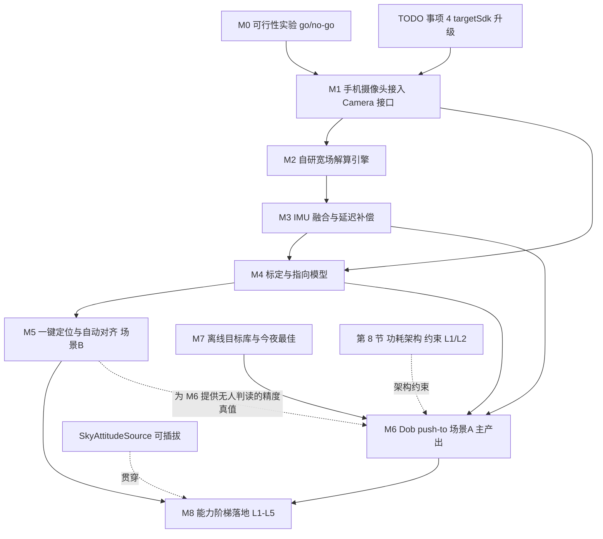

# 手机板解指向系统方案（对标 StarSense Explorer）

> 状态：**方案阶段，未开始实施**。本文档只定义目标、架构、里程碑与验收标准。
>
> 状态约定与 `TODO.md` 一致：`[ ]` 待办、`[~]` 进行中、`[x]` 已完成、`[-]` 暂不实施。

## 1. 目标与定位

用手机自带摄像头拍摄星野、盲解出当前指向，为望远镜提供**无需对齐的绝对指向感知**。在此基础上提供两个同等重要的一等场景：

- **场景 A —— Dob push-to（社团大视场牛反，主要产出）**：手机装在镜筒上，手推镜筒，手机解析并用箭头与靶心指示往哪个方向推。功能对标 StarSense Explorer，但不绑定特定镜筒与夹具，且**必须尽可能省电**。
- **场景 B —— 电控赤道仪自动对齐（本人自用，同时充当精度真值台）**：开机不做两星校准，手机拍一张解出真实指向并 sync 赤道仪，之后 GOTO 直接可用。功能等价于 Celestron StarSense AutoAlign 硬件配件。

两个场景共用 M0–M4 的全部基础设施，只在最后一层（引导界面 vs 对齐编排）分叉。**开发顺序上仍然先做 B**，因为电控赤道仪能回读坐标，是唯一能在无人判读的情况下量化 M2–M4 精度的手段；B 跑通即等于 A 的地基已经验收过。详见第 6 节。

**分发定位**：自用 + 免费提供给社团与其他玩家，不商业化。

**设计原则：兼容与精度不是二选一，而是可升级能力栈。**

- **基线必须人人可用**：只有手机也能跑通（手机板解 + IMU），机型能力不足时降级但不断档。
- **有硬件就升级精度**：接上专用寻星相机、主成像相机、电控赤道仪后，同一套指向会话自动吃到更准的绝对姿态源，不必换应用或换工作流。
- **省电约束主要落在手机基线档**：Dob 用手机时事件驱动占空比仍然强制；外接相机若有独立供电，功耗策略可放宽，但会话状态机仍复用同一套。见第 3 节能力阶梯与第 8 节。
- 不投入与商业授权、激活码、硬件配套销售相关的任何工作。

## 2. 对标分析

### StarSense Explorer 的真实优势

| # | 优势 | 性质 |
|---:|---|---|
| 1 | 零门槛：不需电控、极轴、星对齐，架起来即用 | 产品定位 |
| 2 | 用板解替代 IMU：IMU 只有几度精度，目镜低倍视场约 1°，板解 0.25° 刚好跨过可用线 | **唯一技术护城河** |
| 3 | 板解与 IMU 混合：间歇板解 + 陀螺补帧，推镜时屏幕连续跟随 | 工程 |
| 4 | 交互细节：箭头 + 靶心 + 红黄绿三色、靠近自动放大视场、停手自动重解、蓝牙语音播报 | 交互设计 |
| 5 | 硬件极简：工厂预调角度斜镜 + 带微调旋钮手机夹，白天对远处地物一次性标定 | 硬件 |

### 已知短板（差异化机会）

- 月光与光污染下大量失败，是应用商店差评主因。
- 手机兼容性不稳定，必须摘手机壳、相机需精确压在斜镜正上方。
- 每台望远镜一个激活码，夹具不单卖，无法装到自有镜筒。
- 目标库偏少，四寸口径可见的目标存在缺失。
- 只做 push-to：不驱动电控、不拍摄、不叠加、不导星。
- 需联网下载数据文件，存在下载卡死反馈。
- 连续用相机耗电大。

## 3. 能力阶梯与精度预算

**不要把"兼容"和"精度"做成互斥优先级。** 正确模型是：同一套指向会话（`PointingSession`）可挂接多种绝对姿态源；缺硬件时用手机基线，有硬件时自动升档。场景 A/B 只决定交互外壳（push-to vs 自动对齐），不决定精度上限。

### 3.1 能力阶梯

| 档 | 配置 | 绝对姿态源 | 相对姿态 | 典型精度 | 谁在用 |
|---|---|---|---|---|---|
| **L0** | 仅手机 IMU | 无（不可靠） | 陀螺积分 | 数度，不可进目镜 | 仅作降级提示 / 粗 AR，不作为验收档 |
| **L1 基线** | 手机摄像头 + IMU | 手机宽场板解 | 陀螺 + 延迟补偿 | **≤ 15′** | 社团 Dob，只带手机就能用 |
| **L2** | L1 + 刚性夹具 / 指向模型 | 同上，标定与挠曲更好 | 同上 | **≤ 6′** | 固定安装、有校准数据的同一手机 |
| **L3** | 专用寻星/导星相机（USB）作天传感器 | 外接宽场板解 | 可选 IMU 或赤道仪编码 | **≤ 2–3′** | 有闲置导星相机或小寻星镜的玩家 |
| **L4** | 主成像相机 ASTAP | 窄场板解 | 赤道仪闭环 | **≤ 0.5′** | 已有精定 GOTO 的拍摄平台 |
| **L5** | L4 + 电控 sync / 精定 / 导星 | 多源融合 | 全套 | 亚角分级工作流 | 完整观测台 |

**升级规则**：会话启动时枚举可用源，按 L4 > L3 > L1 选择最高可用绝对源；L2 是 L1 的标定增强，不是新硬件。缺更高档时静默回落到 L1，UI 显示当前档位与可升级提示（例如"接上导星相机可提升到角分级"），绝不因缺硬件而无法启动。

### 3.2 手机基线（L1）环节误差

| 环节 | 预期误差 | 说明 |
|---|---|---|
| 手机宽场板解本身 | 1–3′ | 60° 视场 / 1200 万像素，约 1′ 每像素 |
| 手机↔镜筒标定残差 | 2–5′ | 取决于标定方式，见 M4 |
| 支架挠曲（随高度角） | 5–15′ | **L1 误差主项**；L2 用指向模型压下去 |
| 陀螺补帧漂移（解算间隔内） | 1–5′ | 需延迟补偿，见 M3 |

**关键判断**：SSE 的 0.25° 误差主要不来自解算，而来自斜镜与支架挠曲、标定残差、陀螺漂移。L1→L2 的路径是标定与指向模型；L2→L3/L4 的路径是换更稳、更暗、视场更合适的光学传感器——两者都要，不是二选一。

### 3.3 场景验收底线（不是精度上限）

| 场景 | **最低可验收** | 有硬件时的目标 |
|---|---|---|
| Dob 目视（场景 A） | L1 ≤ 15′（与 SSE 同级，低倍目镜可用） | L2/L3 能到数角分更好，界面照样吃 |
| 电控对齐（场景 B） | L1/L2 ≤ 6′ 后 sync | L4 精定 ≤ 0.5′（现有闭环） |

L1 档的功耗策略仍按第 8 节做严；升到 L3/L4 后若外设自供电，可放宽相机占空比，但引导状态机与融合接口不变。

## 4. 架构与复用

### 直接复用（本项目最大红利）

| 现有能力 | 路径 | 复用方式 |
|---|---|---|
| 统一相机接口 | `camera/Camera.kt` | 手机摄像头实现同一接口，自动接入预览/录制/板解 |
| 预览管道与帧处理 | `camera/PreviewPipeline.kt`、`FrameProcessor.kt` | 不改动 |
| ASTAP 板解 | `astrometry/AstapRunner.kt` | M1 直接复用（需放宽 FOV 上限） |
| 天文归算 | `astro/CoordinateTransform.kt` 等 6 个文件 | J2000↔地平双向、岁差章动、蒙气差全部已就绪 |
| 赤道仪抽象与 sync | `mount/MountModule.kt`、`Lx200MountController.syncTo()` | M2 自动对齐直接调用 |
| 精定闭环 | `mount/PrecisionGoto.kt` | 手机粗定后接管 |
| 红光夜视 | `ui/theme/Theme.kt` `AstroRedColorScheme` | 引导界面直接用 |
| 星图选目标（仅场景 B） | `ui/screens/StarMapScreen.kt` + `app.js` | 需补反查视场方向接口 |

**注意：场景 A 不使用 Stellarium WebView。** WASM 引擎加 WebView 渲染是全应用最贵的 CPU/GPU 负载，与省电目标直接冲突。Dob 引导界面改用原生 Compose 轻量星图，数据取自 M7 的离线目标库与亮星表。附带两个好处：给社团的构建不必带 Stellarium 资源，APK 更小，且该路径不涉及 AGPL 资源再分发义务。

### 核心抽象：可插拔绝对姿态源

这是"可兼容 / 可扩展 / 可升级"的技术落点。下游（引导、sync、精定）只消费统一结果，不关心帧来自哪里。

```
pointing/AbsoluteSkyFix.kt      一次绝对指向：ra/dec、epoch、fov、残差、来源档位、曝光中点时间
pointing/SkyAttitudeSource.kt   接口：requestFix(prior?) → AbsoluteSkyFix；capability / powerProfile
pointing/RelativeAttitudeSource 接口：陀螺积分（手机 IMU；将来也可接赤道仪编码器增量）
pointing/AttitudeFusion.kt      绝对 fix + 相对积分 + 延迟补偿（与具体相机无关）
pointing/PointingSession.kt     会话编排：选源、占空比、引导/对齐外壳
```

| 实现 | 对应档 | 帧从哪来 |
|---|---|---|
| `PhoneSkyAttitudeSource` | L1/L2 | `PhoneCamera` → 宽场解算 |
| `UsbFinderSkyAttitudeSource` | L3 | 现有 USB `Camera`（导星/寻星）→ 宽场或中等视场解算 |
| `MainCameraSkyAttitudeSource` | L4 | 主成像相机 → 现有 `AstapRunner` / 精定闭环 |
| （可选）`MountEncoderRelativeSource` | 增强相对层 | 电控赤道仪坐标差分，有则优先于纯 IMU |

现有 `camera/Camera.kt` 已经统一了六品牌 USB 相机；手机只是再加一个实现。**指向层再抽一层 `SkyAttitudeSource`，避免把"手机解析"写死进引导逻辑**——否则接上寻星相机时又要重写半套。

### 新增模块

```
camera/PhoneCamera.kt           手机摄像头，实现 Camera 接口（Camera2 全手动）
camera/PhoneCameraCapability.kt 机型能力探测与降级策略
pointing/AbsoluteSkyFix.kt      统一绝对指向结果
pointing/SkyAttitudeSource.kt   可插拔绝对姿态源接口
pointing/AttitudeFusion.kt      多源融合与延迟补偿
pointing/SkySolver.kt           宽场解算引擎接口（ASTAP 实现 + 自研实现）
pointing/StarPatternSolver.kt   自研几何哈希解算器
pointing/StarPatternIndex.kt    内置亮星哈希库加载
pointing/ImuAttitudeTracker.kt  陀螺姿态积分（RelativeAttitudeSource 实现）
pointing/MotionGate.kt          运动/静止判定，驱动整套占空比（省电核心）
pointing/PointingSession.kt     指向会话：选源、状态机、功耗策略
pointing/MountAlignment.kt      传感器↔镜筒标定（3 参数旋转；对各源各存一份）
pointing/PointingModel.kt       锥差、挠曲、非正交建模
pointing/PushToGuidance.kt      引导量计算与状态机（含地平式专用处理）
pointing/PowerBudget.kt         会话能耗计量与自适应降级
catalog/DeepSkyCatalog.kt       OpenNGC 等离线目标库
catalog/VisibilityRanker.kt     今夜最佳排序
ui/screens/PushToScreen.kt      靶心引导界面（原生 Compose 轻量星图）
ui/screens/SkyFixScreen.kt      一键定位/自动对齐界面
ui/components/NightChart.kt     低功耗星图绘制（替代 WebView）
```

## 5. 里程碑

### [~] M0 可行性实验（go/no-go 门）

**目标**：确认手机相机在真实观测环境下能拍到足以解算的星场。**不通过则 L1/L2（社团仅手机路径）不成立，不应在手机基线上继续投入；若已有 USB 寻星/主相机，L3/L4 仍可独立推进，但场景 A 的主分发形态失效。**

**涉及模块**：`PhoneCameraDebugScreen`（相机页右上角手机图标入口；非正式 Tab）

**已实现（代码）**

- Camera2 全手动单次拍摄：`PhoneSkyCapture`（AE/AF/AWB off、锁无穷远、NR/Edge/OIS off；优先 RAW_SENSOR，回退 YUV 取 Y）。
- 能力探测：`PhoneCameraCapability`（曝光/ISO/RAW/FOV 估算等，可落盘到状态文本）。
- 星点提取：`WideFieldStarExtractor`（网格中值去背 + 阈值 + 质心 + 密度法极限星等估算）。
- 落盘：FITS（必有）；RAW 时另存 DNG。目录：`Android/data/.../files/phone_sky_m0/`。
- 权限：`CAMERA` + `CameraPermissionPolicy`；单元测试已覆盖提取器与权限策略。

**仍需真机（验收门）**

- [ ] 单帧稳定提取 ≥ 15 个可用星点，估算极限星等 ≥ 5.5。
- [ ] 关闭厂商后处理后，图像中无伪星点、无被抹除的暗星。
- [ ] 记录各测试机型的曝光上限、ISO 上限、是否支持 RAW。
- [ ] 在自家阳台、社团常用观测地各测一轮，含有月与无月。

**风险**：厂商夜景与多帧降噪会抹除暗星甚至生成伪星点；部分国产 ROM 的 Camera2 长曝上限很低或不开放 RAW。这是本里程碑要暴露的核心不确定性。

---

### [ ] M1 手机摄像头接入现有相机抽象

**目标**：手机拍摄的星野图能走完现有 ASTAP 链路并盲解出坐标；同时立下 `SkyAttitudeSource` 接口，让后续寻星/主相机源能挂同一会话。

**涉及模块**

- 新增 `camera/PhoneCamera.kt`，实现 `Camera` 接口，产出 `FrameData`（MONO16/MONO8）
- 新增 `pointing/SkyAttitudeSource.kt`、`AbsoluteSkyFix.kt`；先提供 `PhoneSkyAttitudeSource`（内部仍调 ASTAP）
- `camera/DahengCameraManager.kt`：`CameraBrand` 增加内置摄像头枚举值，枚举与打开逻辑增加非 USB 分支
- `astrometry/AstapRunner.kt`：`fovDeg` 上限从 6.0° 放宽到 90°
- `astrometry/D50Manager.kt`：扩展为多星表管理，增加宽场星表条目
- `license/License.kt`：确认手机摄像头不受工业相机 SN 门控与试用录制限制影响
- `AndroidManifest.xml`：增加 `CAMERA` 权限与运行时申请

**内容**

- 宽场星表：ASTAP 提供面向宽场镜头的星表（W 系列），实施时确认当前发布名称、体积与许可。
- 内参初值取 `CameraCharacteristics` 的焦距与传感器尺寸推算 FOV；解算成功后反推真实像素比例并拟合一阶径向畸变，做自标定。
- **session 生命周期是功耗关键**（见 8.1）：`PhoneCamera` 必须支持"打开设备但不出流"与"彻底关闭 session"两级停止，而非只停 repeating request。同时记录重开 session 的实测延迟，作为 `IDLE_ARMED` 超时取值依据。
- 解算用的输出尺寸不必是全分辨率，优先选较小的 stream configuration 或做 2×2 合并。

**验收标准**

- [ ] 手机摄像头在相机页可作为一路相机源连接、预览、存 FITS。
- [ ] 无坐标提示下 ASTAP 能解出手机星野图坐标，与已知指向一致。
- [ ] 现有 USB 工业相机路径无回归。
- [ ] 手机摄像头连接不触发 SN 检查。
- [ ] 提供彻底关闭 session 的接口，且 `dumpsys` 可确认相机确实被释放。
- [ ] 记录各测试机型 session 重开延迟。
- [ ] `PhoneSkyAttitudeSource` 已实现 `SkyAttitudeSource`；下游只依赖接口，不直接依赖 `PhoneCamera`。

**风险**：中。ASTAP 走 `ProcessBuilder` 拉进程加文件 IO，单次数百毫秒到数秒，**只能作为验证工具，无法支撑连续解算**，实时性由 M2 解决。

---

### [ ] M2 自研宽场解算引擎

**目标**：全离线、单次 300 ms 以内、星表打进 APK。

**涉及模块**：`pointing/SkySolver.kt`、`StarPatternSolver.kt`、`StarPatternIndex.kt`

**算法**（tetra3 一类的几何哈希，即 Celestron LISA 算法所做的事）

1. 星表取 Tycho-2 亮于 7 等子集，约 2 万颗；实施时确认许可与数据源。
2. 离线预计算四星组的归一化边长比作为哈希键，生成索引文件，预期体积几 MB。
3. 运行时：去背 → 提星 → 质心细化 → 取最亮约 20 颗 → 构四星组 → 查哈希表取候选 → Kabsch 求旋转 → 用全部星点验证匹配率 → 输出赤经、赤纬、旋转角与实际视场。
4. 有 IMU 先验时只搜索对应天区，速度再快一个量级并显著降低误匹配。

**验收标准**

- [ ] 星表索引进入 APK，运行时零联网、零下载。
- [ ] 中端机型单次解算 ≤ 300 ms（有先验时 ≤ 100 ms）。
- [ ] 用 M0/M1 采集的真实图像集做回归，成功率与误匹配率有量化基线。
- [ ] 误匹配必须可检出（匹配率门限 + 残差门限），宁可报失败也不给错解。
- [ ] 有不依赖硬件的解算单元测试（固定图像集 + 期望坐标）。

**风险**：中高。这是本方案唯一的算法攻坚项，但可先靠 M1 的 ASTAP 路径把物理问题验证完，再替换引擎，风险是隔离的。

---

### [ ] M3 IMU 姿态跟踪与融合

**目标**：解算间隔之间平滑跟随，推镜或转动时无可感滞后。

**涉及模块**：`pointing/ImuAttitudeTracker.kt`

**要点**

- **不使用** `TYPE_ROTATION_VECTOR` 的绝对朝向：望远镜是金属与电机结构，磁干扰会使罗盘偏出数度。绝对姿态**只**由板解提供。
- `TYPE_GYROSCOPE`（约 200 Hz）只做相对旋转积分；加速度计重力向量约束俯仰漂移（对地平式镜尤为有用）。
- 状态包含天球姿态四元数与陀螺零偏，互补滤波或轻量卡尔曼。
- **延迟补偿（必做）**：板解结果对应曝光中点时刻，而解算完成时已过去一到两秒。必须把姿态回溯到曝光中点做观测更新，再重新前向积分到当下。不做这一步会产生明显滞后，正是 SSE 手感被抱怨的点之一。曝光中点已有 `FitsHeaderReader.midExposureTime()` 可复用思路。
- 静止检测：陀螺能量低于阈值持续约 300 ms，触发自动重解。
- **传感器占空比（见 8.1）**：陀螺只在运动相关状态开启；`registerListener` 一律带 `maxReportLatencyUs` 以允许 sensor hub 批处理（引导时 50–100 ms，空闲时更长），让 AP 能休眠。`OBSERVING` 期间只留低速率加速度计作唤醒门。

**验收标准**

- [ ] 连续转动 30° 后停下，融合姿态与随即板解结果之差 ≤ 5′。
- [ ] 存在磁干扰源（贴近电机）时姿态不发生跳变。
- [ ] 陀螺零偏在 10 分钟内被正确估计并收敛。
- [ ] 有姿态积分与延迟补偿的纯算法单元测试。
- [ ] `OBSERVING` 期间陀螺已注销，`dumpsys` 可确认；唤醒门在真实推镜速度下漏检率为零。
- [ ] 运动/静止判定有合成序列单元测试（缓慢推镜、轻微震动、目镜换手带来的扰动）。

**风险**：中。延迟补偿实现错误的表现是"越推越偏"，需要专门的合成序列测试。

---

### [ ] M4 传感器↔镜筒标定与指向模型

**目标**：把任意绝对姿态源的指向换算为镜筒光轴指向，并随使用累积精度。**每个 `SkyAttitudeSource` 各自持有一份标定**（手机与寻星相机几何不同，不能共用同一旋转）。

**进度**

- [x] `CalibrationWizardScreen` 三档向导壳（白天 / 星标 / 主相机），Mount Tab 入口
- [ ] 旋转求解、持久化、主相机 ASTAP 自动标定、指向模型

**涉及模块**：`pointing/MountAlignment.kt`、`pointing/PointingModel.kt`、`pointing/SkyAttitudeSource.kt`

**关键认识**：数学上只是求传感器坐标系到镜筒光轴坐标系的固定旋转（3 参数）。**不要求传感器光轴与镜筒轴平行**，只要刚性固定，任意朝向都可解。对手机这意味着不需要工厂预调斜镜；对寻星相机意味着寻星镜可以偏轴安装。

**三档标定**（对每个源分别适用）

1. **白天粗标**（对标 SSE）：对远处地物，用户在预览中点出镜筒十字丝对准的那一点。
2. **夜间星标**：亮星居中于目镜后按"此刻居中"，传感器同时板解。换 3 个以上不同天区重复，最小二乘求解。
3. **主相机全自动标定（跨源升级路径）**：主相机拍一张经 ASTAP 解出真实光轴指向，手机或寻星源同时板解，一次拍摄即得一组约束；采 3–5 组即可全自动求解。这是 L1/L3 升到更准几何的主要手段。

**指向模型（L2）**：在标定之上叠加锥差、随重力方向变化的挠曲项、轴系非正交，把每晚解算结果持续累积。有主相机真值时优先用主相机残差拟合。**SSE 每次开机都要重标；本系统同一夹具可越用越准，并在换源时保留各自标定。**

**验收标准**

- [ ] 三档标定均可用，标定结果按源持久化并可查看残差。
- [ ] 主相机自动标定的残差 ≤ 3′。
- [ ] 加入挠曲项后，高度角从 20° 到 80° 的残差不呈系统性漂移（L2 验收）。
- [ ] 手机源与 USB 相机源可同时存在两套标定，切换源时不串用。
- [ ] 标定与指向模型有纯数学单元测试（合成约束 + 期望参数）。

**风险**：中高。200 g 手机挂在镜筒侧面，随高度角变化的挠曲可达十几角分，是 L1 误差主项。L2 指向模型 + 靠近重心安装；升到 L3 后机械挠曲仍在，但传感器可装在更刚的位置。

---

### [ ] M5 一键定位与电控赤道仪自动对齐（本人主收益）

**目标**：电控赤道仪不做两星校准，架起来后任意可用绝对源拍一张即完成对齐；有主相机则继续精定升档。

**涉及模块**：`ui/screens/SkyFixScreen.kt`、`mount/MountModule.kt`、`pointing/PointingSession.kt`

**流程**

1. `PointingSession` 选最高可用 `SkyAttitudeSource` 取 fix → 经该源标定与指向模型换算出镜筒当前指向。
2. 支持 sync 的协议（LX200/OnStep、iOptron）：直接 `controller.syncTo()`。
3. Sky-Watcher 不支持 sync：走 `PrecisionGotoMath.correctiveCommand()` 的纠偏路径，或引导用户完成 SynScan 侧对齐后再校正。
4. 若主相机已连接，接着走现有 `startPrecisionGoto` 精定确认（L4）。

**验收标准**

- [ ] OnStep/iOptron：冷启动不做星对齐，一键定位后 GOTO 落点误差 ≤ 6′。
- [ ] Sky-Watcher：纠偏路径可用，并有明确的能力差异提示。
- [ ] 全流程可被现有全局 STOP 中止，不与 `MountMotionRunner` 的互斥语义冲突。
- [ ] 板解失败、标定缺失、赤道仪未连接均有清晰指引。

**风险**：低中。复用现有 sync 与精定链路，主要工作是编排与提示。

---

### [ ] M6 Dob push-to 引导（场景 A 主产出）

**目标**：手机装在社团大视场牛反上，手推镜筒时手机解析并指示推向。**本人无手动镜筒，手感需社团 beta 测试者验证；但精度地基已由 M5 在电控赤道仪上量化过。**

**涉及模块**：`pointing/PushToGuidance.kt`、`pointing/PointingSession.kt`、`ui/screens/PushToScreen.kt`、`ui/components/NightChart.kt`

**进度（可与 M0 夜间实测并行）**

- [x] `PushToGuidance` 纯算法 + 单测（方位环绕、天顶退化、滞回分档、目镜 FOV 归一化）
- [x] `PushToScreen` 假数据驱动靶心/箭头壳（Mount Tab 入口）
- [x] `SkyAttitudeSource` / `MockSkyAttitudeSource` 接口占位
- [ ] 真姿态源接线、语音、息屏模式、社团手感验收

#### 地平式（Dob）专属处理

Dob 是地平式且纯手动，这带来若干与赤道仪完全不同的性质，其中第 1 条是整个省电方案的基石。

1. **静止的 Dob 指向不会变化，因此不需要任何解算。** 赤道仪在跟踪，指向持续变化；Dob 不跟踪，只有人推它才动。所以解算预算是"每次停手一次"，而不是"每秒一次"。一次目标捕获通常只需 2–4 次解算，之后目视观察的几分钟里解算次数为零。这是相对 SSE 的结构性省电优势，详见第 8 节。
2. **引导量天然就是高度与方位**：直接对应"往上推 / 往下压"和"向左 / 向右转"，不存在赤道仪的镜筒东西侧与中天翻转问题，引导逻辑比 GEM 简单得多。
3. **重力向量提供高度角的免费绝对参考**（约 0.5° 精度）。不足以定位，但有两个用处：给解算器缩小搜索天区，以及在解算出现误匹配时作为粗校验直接否掉离谱结果。
4. **天顶附近方位退化**：接近天顶时"向左转"的物理含义变得不稳定，需要切换为"先降低高度再转方位"的两步提示，并在界面上明示。
5. **特氟龙垫的静摩擦会让镜筒突然一跳**，用户很难做微小移动。因此引导必须容忍过冲，且近距离时给出"移动量"而不只是方向；到位判定要带滞回，避免在阈值附近反复红绿跳变。
6. **低倍目镜真实视场 1.5–2°**，到位判据按目镜实际视场的百分比给，而不是固定角度。需要让用户填目镜与镜筒焦距（可存多套目镜配置）。

#### 手机安装几何

标定求解的是任意 3 参数旋转，**不要求相机光轴与镜筒轴平行**，因此不需要 SSE 那种工厂预调角度的斜镜。但有一条硬约束：**相机必须始终看到开阔天空**，不能看向镜筒本体、地面或观测者。

- **推荐几何**：手机固定在镜筒上部，相机大致沿镜筒轴朝天，屏幕朝向站在目镜旁的观测者。全高度角范围内相机都看天，无需镜子。
- **不推荐**：相机垂直于镜筒轴。此时镜筒指高空时相机会看向地平线（树木、路灯），是失败率最高的几何。
- 若因手机夹形态必须让相机偏转，允许加一面普通平面镜；标定会自动吸收镜面引入的旋转，但需注意镜面会降低信噪比。
- 安装位置尽量靠近镜筒重心与刚性结构，减小随高度角变化的挠曲（见 M4）。

#### 交互

- 距离自适应：> 10° 给大箭头与方位提示；1–10° 给带刻度十字并显示剩余角度；小于目镜视场时画出真实视场圈与目标点。红黄绿三色反馈。
- 停手后（`MotionGate` 判定静止）自动触发一次解算精化，推的过程中**不解算**。
- **息屏语音模式（省电与体验双赢）**：屏幕关闭，只靠陀螺推算与语音播报"上 1.5 度、左 0.5 度"，停手时解算一次并播报结果。屏幕通常是最大耗电项，这个模式能显著延长会话时间，同时让观测者眼睛一直留在目镜上、完全不破坏暗适应。SSE 有语音播报且用户评价很高，但没有把它和息屏省电结合起来。
- 白光防护：所有界面复用 `AstroRedColorScheme`，默认最低亮度，纯黑底红字（AMOLED 上同时是省电措施）。
- 界面元素补齐可访问名称，与 `TODO.md` 事项 9 的标准一致。

**验收标准**

- [ ] 引导量计算有纯算法单元测试：含天顶退化、方位过 0/360 边界、目镜视场归一化。
- [ ] 靶心状态迁移（远/中/近/到位）有状态机测试，含滞回行为。
- [ ] 语音播报可关闭，使用离线 TTS，不干扰系统媒体音量。
- [ ] 息屏语音模式下引导可用，且实测功耗低于亮屏模式（见第 8 节指标）。
- [ ] 引导界面不加载 Stellarium WebView；不带 Stellarium 资源的构建也能完整使用场景 A。
- [ ] 至少 2 名社团 beta 测试者在大视场牛反上确认目标落入低倍目镜视场；**L1 精度底线 ≤ 15′**，有 L2/L3 时记录实际误差并允许更好。
- [ ] 一次完整目标捕获的解算次数 ≤ 4（手机源）；USB 寻星源若自供电可不强制同一占空比，但静止时仍可不解算。
- [ ] UI 能显示当前能力档位；仅手机时为 L1，接上更高源后无需重启会话即可升档（或明确提示重开会话一次）。

**风险**：中。自身缺少手动镜筒，手感与安装几何依赖外部测试者，需提前招募。特氟龙垫静摩擦带来的手感问题只能在真机上暴露。

---

### [ ] M7 离线目标库与今夜最佳

**目标**：打穿 SSE"目标偏少"的短板。工作量小、性价比最高。

**进度**

- [x] `DemoCatalog` + `TargetLibraryScreen` 壳（搜索 / 选目标进推镜）
- [ ] OpenNGC 打包、VisibilityRanker、Stellarium 视场回读

**涉及模块**：`catalog/DeepSkyCatalog.kt`、`catalog/VisibilityRanker.kt`、`app.js`

**内容**

- 引入 OpenNGC（NGC/IC 约 1.3 万条，CC-BY-SA）+ Messier/Caldwell + 亮星名录；确认许可并在第三方声明中登记，与现有 `THIRD_PARTY_*.txt` 惯例一致。
- 排序因子：当前高度角、过中天时间、月距与月相、目标面亮度与用户口径匹配、光污染等级（用户输入或按经纬度粗查）。
- 给 `MercStarMap` 补一个反查当前视场方向的 JS 接口。当前桥接只能单向推送坐标（`centerOnRaDec` 等）与接收 `onTargetSelected`，无法回读用户拖动后的视场方向，这会限制"看星图选目标再引导"的闭环。

**验收标准**

- [ ] 离线目标库进入 APK，无联网依赖。
- [ ] 今夜最佳排序有单元测试（固定时间地点 + 期望顺序）。
- [ ] 星图可回读视场方向，选目标到引导闭环连通。
- [ ] 第三方数据许可声明完整。

**风险**：低。

---

### [ ] M8 与现有能力合流（能力阶梯落地）

**目标**：把第 3 节的 L1–L5 真正接到现有设备树上——同一应用、同一引导/对齐外壳，按已连接硬件自动升档。

**内容**

- `PointingSession` 启动时枚举：手机摄像头、已连接 USB 相机（可标为寻星源）、主成像相机、赤道仪是否可 sync。
- UI 显示当前档位（L1…L4）与"可升级"提示，不强制用户理解抽象名。
- 手动镜：L1/L2/L3 → push-to；电控镜：任意绝对源 → sync / 纠偏 → 可选 L4 精定。
- 接主相机后继续用现有实时叠加、录制、导星、极轴校准。SSE 只覆盖 L1 那一格。
- L3 寻星源优先复用现有导星相机连接路径，避免再造一套 USB 枚举。

**验收标准**

- [ ] 仅手机：场景 A/B 均可启动，档位显示 L1。
- [ ] 手机 + 主相机：自动对齐后可一键进入精定，档位升到 L4。
- [ ] 导星/寻星 USB 相机可作为绝对源单独工作（无手机摄像头权限时仍可用 L3）。
- [ ] 手机摄像头与主相机、导星相机、赤道仪、配件的连接互不干扰（延续 `TODO.md` 事项 7）。
- [ ] 手机摄像头长时间工作时，主相机预览帧率与录制不受影响。
- [ ] 硬件冒烟测试矩阵增加：仅手机 / 手机+赤道仪 / 寻星相机+赤道仪 / 全套 四条路径。

---

## 6. 验证策略：用电控赤道仪当精度真值台

主要产出是社团 Dob 的 push-to（场景 A），但**开发与验收顺序上仍然先做电控赤道仪路径（场景 B）**。理由不是 Dob 不重要，而是 Dob 上根本无法量化误差——只能靠人眼判断"目标有没有进目镜"，出了问题也分不清是解算、标定、挠曲还是陀螺漂移。电控赤道仪能回读坐标，是唯一可以无人判读地把 M2–M4 钉死的手段。**B 验收通过就等于 A 的地基已经验收过**，M6 剩下的只有引导交互与手感。

- **标定与解算精度量化**：赤道仪 GOTO 到一系列已知坐标，每点同时记录赤道仪回读坐标与手机板解换算出的镜筒指向，直接得到误差分布。
- **挠曲建模数据采集**：按高度角 20°–80° 网格扫点拟合挠曲项。这个数据集用手动镜筒根本采不出来。
- **模拟推镜**：用方向键手动移动模拟手推过程，验证 M3 的陀螺融合与延迟补偿，以及 `MotionGate` 的运动/静止判定与整套占空比逻辑。
- **地平式引导量的数学验证**：把赤道仪回读坐标换算成地平坐标，即可验证 M6 引导量计算与天顶退化处理的正确性。手感无法这样验证，但数学可以。
- **端到端闭环**：手机粗定 → sync → GOTO → 主相机 ASTAP 精定，用精定结果反过来审计手机链路的绝对精度。

**在 Dob 上仅需验证三件无法在赤道仪上验证的事**：安装几何是否全高度角范围都看到开阔天空、特氟龙垫静摩擦下的引导手感、以及实际会话功耗。前两件靠 beta 测试者，第三件靠第 8 节的能耗计量。

## 7. 机型兼容性兜底（基线不断档）

免费分发给社团意味着机型高度分散。**兼容性兜底保证 L1 能启动；精度上限由第 3 节能力阶梯决定，两者并行，不互相牺牲。**

- `PhoneCameraCapability` 在首次运行时探测并落盘：硬件级别、是否支持 RAW、`SENSOR_INFO_EXPOSURE_TIME_RANGE`、ISO 范围、是否可关闭降噪与 OIS。
- 手机侧分级降级：全手动 + RAW → 全手动 + YUV → 曝光受限（多帧叠加补偿）→ 明确告知本机无法作绝对源，但若已接 USB 寻星/主相机仍可走 L3/L4。
- 提供"拍一张诊断图"入口，用户可导出 DNG/FITS 与能力报告，便于远程排查。这直接对治 SSE 那种"兼容性玄学、无法自查"的体验。
- 屏幕类型影响功耗策略：LCD 机型的红光暗屏省电收益远小于 AMOLED，应更主动地推荐息屏语音模式。见第 8 节。

## 8. 功耗架构与预算

省电在本方案中不是优化项而是**对手机基线档（L1/L2）的架构约束**，因为 SSE 最一致的负面反馈就是耗电。目标是让 3 小时 Dob 会话在仅用手机时不需要外接电源。

升到 L3/L4 且外设自供电时，可放宽该源的相机占空比（例如寻星相机保持低帧预览），但 `PointingSession` 状态机、静止时不解算、息屏语音等策略仍复用；不要为高端档另写一套会话逻辑。

### 8.1 核心思想：事件驱动占空比

**决定性的事实是：静止的 Dob 指向不会变化，所以不需要解算。** 赤道仪在跟踪，指向持续改变；Dob 只有人推它才动。这意味着解算预算是"每次停手一次"，而不是 SSE 那种"周期性持续拍摄"。

会话状态机（`pointing/PointingSession.kt`）：

| 状态 | 触发 | 相机 | 陀螺 | 解算 | 屏幕 |
|---|---|---|---|---|---|
| `OBSERVING` | 长时间静止 | session 关闭 | 停用或最低速率 | 不解算 | 可息屏 |
| `MOVING` | 唤醒门检测到运动 | session 保持但不出流 | 200 Hz | **不解算** | 引导显示或息屏语音 |
| `SETTLING` | 运动停止 300 ms | 准备出流 | 200 Hz | 待触发 | 同上 |
| `SOLVING` | 稳定确认 | 单次拍摄 | 200 Hz | 一次 | 同上 |
| `IDLE_ARMED` | 解算完成 | session 保留 15 s | 降速 | 不解算 | 同上 |

两个关键点：

- **推镜过程中完全不解算**。此时图像本身是模糊的，而且结果落地时早已过期。不解算既省电又更准，M3 的陀螺推算负责这段时间的连续跟随。
- **空闲时必须真正关闭相机 session，而不是只停 repeating request**。streaming 状态下 ISP 持续工作，这正是 SSE 耗电的根源。代价是重开 session 有 200–600 ms 延迟，所以用 `IDLE_ARMED` 保留 15 s 兜住"可能还要再推一下"的情况，超时才关闭。

**唤醒门（`pointing/MotionGate.kt`）**：`OBSERVING` 期间用低速率加速度计（10–25 Hz，多数机型可由 sensor hub 批处理，AP 开销极低）检测姿态变化，才拉起陀螺与相机。可评估 `TYPE_STATIONARY_DETECT` / `TYPE_MOTION_DETECT`（API 24+，跑在 sensor hub，AP 开销近零），但这两个是为"人携带设备"调参的一次性触发器，对缓慢推镜可能不灵敏，**需实测后再决定是否可靠，默认用低速率加速度计兜底**。

一次典型目标捕获只需 2–4 次解算，之后目视观察的几分钟内解算次数为零。相机在整个会话中的开启时间预期低于 5%。

### 8.2 各耗电项与对策

| 耗电项 | 量级（估算） | 对策 |
|---|---|---|
| **屏幕** | AMOLED 纯黑底红字最低亮度约 0.15–0.4 W；亮白高亮 1.5–3 W；LCD 因背光即使最低也约 0.5–0.8 W | 纯黑底红字（复用 `AstroRedColorScheme`）、默认最低亮度、**息屏语音模式**、通过 `preferredDisplayModeId` 取最低刷新率（LTPO 机型收益显著） |
| **相机 session 持续 streaming** | 1.5–3 W | **事件驱动，空闲即关 session**。与 SSE 的最大差别所在 |
| 单次拍摄 + 解算 | 每次约 5–10 J | 次数极少，可忽略 |
| 陀螺 200 Hz + CPU 常醒 | 0.2–0.5 W | 仅在 `MOVING`/`SETTLING`/`SOLVING` 期间开；用 `maxReportLatencyUs` 批处理（引导时 50–100 ms，空闲时更长），让 AP 能休眠 |
| Stellarium WebView / WASM | 量级同亮屏，最贵的单项 | **场景 A 完全不加载**，改用原生 Compose 星图 |
| Compose 高频重组 | 中 | 引导覆盖层独立子树 + 单 Canvas 读快照状态，沿用 `TODO.md` 事项 7、8 已验证过的做法 |
| GPS | 中 | 只取一次 last known location，百米精度足够，不做持续定位 |
| RAW 全分辨率读出与落盘 | 中 | 解算只需亮度通道；优先选较小输出尺寸或 2×2 合并，星点提取 CPU 降到约四分之一，同时提高单像素信噪比 |

### 8.3 会话能耗预算（估算，待实测校准）

典型手机电池 4500–5000 mAh @ 3.85 V ≈ 17–19 Wh。3 小时 Dob 会话按上述占空比估算：

| 分项 | 估算 |
|---|---|
| 解算约 100 次 × 8 J | ≈ 0.2 Wh |
| 引导态累计 20 分钟（陀螺 + CPU + 暗屏） | ≈ 0.2 Wh |
| 亮屏静止（选目标、看星图）累计 30 分钟 | ≈ 0.2 Wh |
| 应用前台基线与系统开销 150 分钟 | ≈ 1.0–2.0 Wh（不确定性最大项） |
| **合计** | **约 1.5–3 Wh，即 3 小时耗电 10%–18%** |

对照 SSE 式持续 streaming：仅相机一项 3 小时就是 4.5–9 Wh，叠加常亮屏幕后与用户反馈的"必须挂充电宝"一致。

**这些数字是估算，唯一作用是给出量级和确定优化重点（结论：屏幕与基线开销主导，相机只在没关 session 时才主导）。真实数值必须按 8.4 实测校准并回写本节。**

### 8.4 度量方式

不靠手感，建立可回归的功耗指标：

- **应用内会话能耗计量（`pointing/PowerBudget.kt`）**：`BatteryManager.BATTERY_PROPERTY_CHARGE_COUNTER`（单位 µAh）在会话首尾取差，报告本次会话消耗 mAh、平均每次解算 mAh、各状态停留时长。实现成本极低却能直接当验收指标。
- `adb shell dumpsys batterystats` + Battery Historian 做分项归因，确认相机、传感器、wake lock 的实际持有时间与状态机设计一致。
- **固定脚本场景**：30 分钟内捕获 10 个目标 + 20 分钟静止观测，每次改动后重跑对比。
- 同时记录电池温度与 `PowerManager.getCurrentThermalStatus()`，确认无热降频。

### 8.5 分级降级

| 条件 | 策略 |
|---|---|
| 电量 < 30% | 主动建议息屏语音模式；解算完立即关 session（不保留 15 s）；降低曝光与输出分辨率 |
| 电量 < 15% | 仅保留手动触发解算，取消全部自动行为 |
| 热状态 ≥ `THERMAL_STATUS_MODERATE` | 降低解算频率与分辨率并提示用户（`getCurrentThermalStatus()` 需 API 29+，与 `TODO.md` 事项 4 耦合） |
| 已接外部电源 | 允许放宽为更积极的解算策略（社团活动常备充电宝） |

### 8.6 功耗验收标准

- [ ] 固定 30 分钟脚本场景，中端 AMOLED 机型实测耗电 ≤ 8%。
- [ ] 3 小时真实会话不需要充电宝。**这是对治 SSE 最直观的口碑点。**
- [ ] 静止观测 5 分钟期间，`dumpsys` 确认相机 session 处于关闭状态。
- [ ] 息屏语音模式实测功耗低于亮屏引导模式的 50%。
- [ ] 会话结束展示实测 mAh，并把结果回写 8.3 节修正估算。
- [ ] 全程无热降频，温度与 thermal status 有记录。
- [ ] LCD 与 AMOLED 机型各有一组实测数据（两者屏幕策略收益差异大）。

## 9. 风险与不实施项

**主要风险**

| 风险 | 应对 |
|---|---|
| 手机相机拍不到足够暗的星（生死线） | M0 作为 go/no-go 门，在真实光污染环境实测 |
| 厂商 ROM 的 Camera2 手动曝光/RAW 支持差异 | M0 收集机型矩阵，M1 做分级降级 |
| 支架挠曲吃掉精度预算 | L2 指向模型 + 安装位置建议；可升 L3 把传感器装到更刚的位置 |
| 发热降频与耗电 | 第 8 节事件驱动占空比 + 分级降级 + 实测计量（主要约束 L1/L2） |
| 唤醒门在缓慢推镜时不灵敏，导致漏检运动 | 默认用低速率加速度计而非 sensor hub 一次性触发器；阈值需在真实 Dob 上标定 |
| 相机 session 重开延迟（200–600 ms）影响手感 | `IDLE_ARMED` 保留 15 s；必要时按电量放宽 |
| Dob 安装几何导致相机看向地面或树木 | 推荐相机沿镜筒轴朝天的几何；界面在解算失败时提示检查遮挡 |
| 缺少手动镜筒，push-to 手感无法自测 | M6 前招募社团 beta 测试者；精度地基先在电控赤道仪上验收（第 6 节） |
| 把手机解析写死进引导逻辑，导致无法接寻星相机 | 强制经 `SkyAttitudeSource`；M8 验收含 L3 无手机路径 |
| `targetSdk` 仍为 28，Camera2 与运行时权限在高版本行为差异大 | 与 `TODO.md` 事项 4 强耦合，建议 M1 前或同步推进 |
| Celestron 声明 patent-pending | 板解本身是数十年公有技术；本项目免费非商业分发，实践风险低。差异化方向（任意支架、双相机标定、指向模型、多源升级）本身即为规避路径。若将来考虑商业化，必须先做专利检索 |

**明确不实施**

- 不做激活码、许可绑定或任何硬件配套销售。
- 不为手机摄像头引入独立的预览/录制管道，一律复用 `Camera` 接口下游。
- 不使用磁力计做绝对朝向。
- M2 完成前不追求实时性，避免在 ASTAP 进程模型上做无用优化。
- **不做周期性持续解算（手机基线）**。任何"每秒拍一张"的 L1 实现都违反第 8 节。
- 场景 A 不加载 Stellarium WebView。
- **不因"目视够用"而砍掉升级路径**：L1 验收底线可以是 15′，但架构必须允许 L2/L3/L4 把同一会话推到角分/亚角分。

## 10. 依赖关系



M7 可与 M2–M4 并行，互不阻塞。功耗架构主要约束手机基线档，贯穿 M1/M3/M6。`SkyAttitudeSource` 从 M1 起就要立接口，避免后续为寻星相机重写引导层；M8 是阶梯验收关，不是事后补丁。
